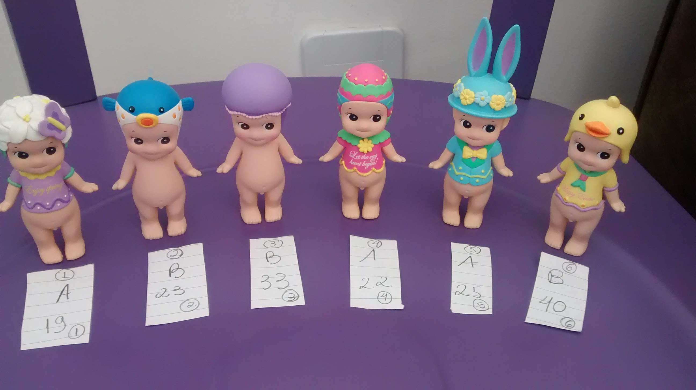
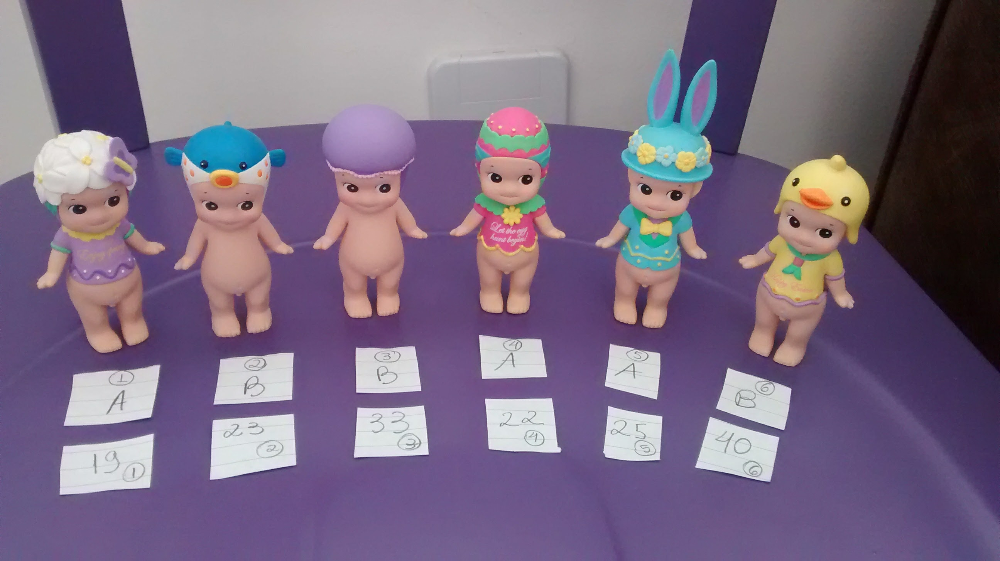
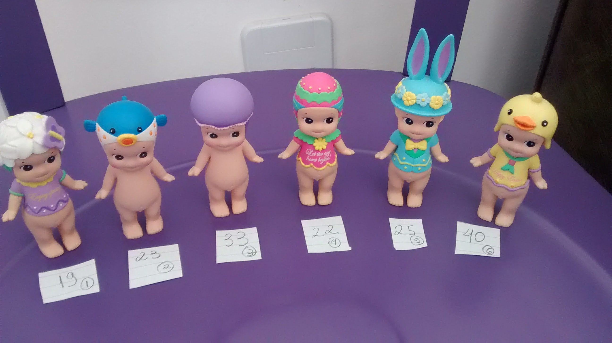
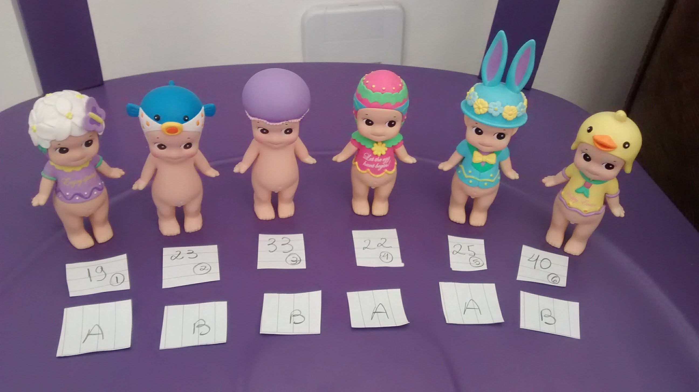
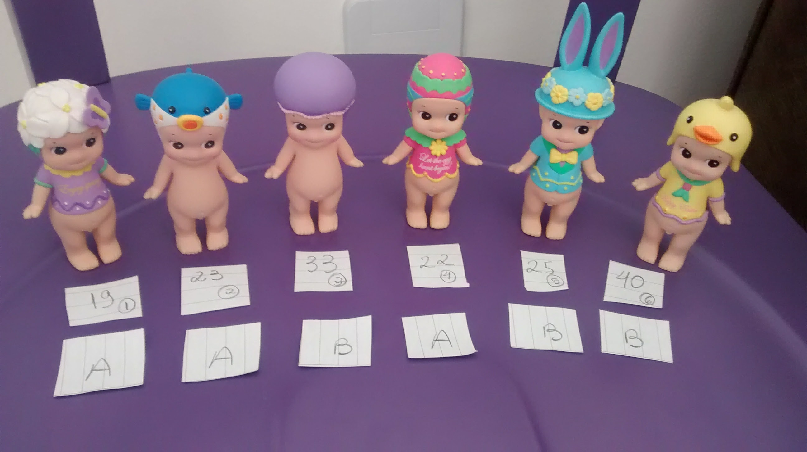
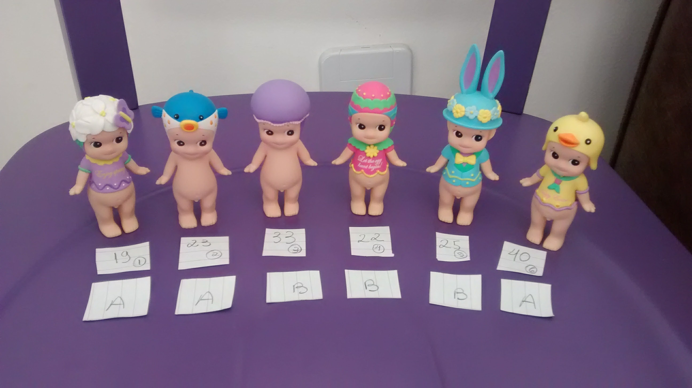

## Introdução {.build}

Testes de permutação/aleatorização podem ser utilizados para avaliar hipóteses sobre efeitos de tratamentos, quando as unidades experimentais aleatoriamente para cada tratamento.

> **Exemplo:** Um grupo de pesquisadores quer avaliar se dois tratamentos, $A$ e $B$ apresentam diferença com relação a uma certa resposta de interesse.

> Os pesquisadores têm à disposição 6 pessoas.

<center></center>

## Exemplo

As 6 pessoas são alocadas, aleatoriamente, a um dos tratamentos:

<center></center>


```{r,echo=FALSE}
#https://www.youtube.com/watch?v=BvdNZNl09eE
#https://www.youtube.com/watch?v=3zIaY2EwzN4&t=101s
#https://www.youtube.com/watch?v=ds8nbvHVu0s
#https://www.youtube.com/watch?v=RFLbkJbd46Y
#https://www.youtube.com/watch?v=GmvpsJHGCxQ&t=303s
#https://www.youtube.com/watch?v=nq3zC4dt6gc


set.seed(12017) #aleatorizacao usada na foto Sonny Angel

n = 6

n1 = 3

n2 = 3

trat <- sample(c("A","A","A","B","B","B"),n,replace=FALSE)
id <- 1:n
resposta <- c(19,23,33,22,25,40)

dados <- data.frame(ID=id,Tratamento=trat,Resposta=resposta)

xbarA <- round(mean(dados$Resposta[dados$Tratamento=="A"]),2)

xbarB <- round(mean(dados$Resposta[dados$Tratamento=="B"]),2)

```

## Exemplo

Após aplicar o tratamento, coletamos a variável resposta de interesse em cada pessoa.


<center></center>

## Exemplo

Dados observados:

```{r,echo=FALSE}
library(printr)
dados
```

## Exemplo {.build}

* $\bar{x}_A = `r xbarA`$

* $\bar{x}_B = `r xbarB`$

* Diferença entre $A$ e $B$ é `r xbarA-xbarB`.

* Esta diferença indica que $A$ tem média inferior à $B$ (pensando populacionalmente, não apenas na nossa amostra)?

* Seria possível, mesmo que não houvesse diferença entre os tratamentos, observar uma diferença de `r xbarA-xbarB`? Isto é, a diferença observada foi devido ao acaso? Ou foi devido ao fato de realmente existir uma diferença entre os tratamentos?

## Exemplo {.build}

* $H_0$: não há diferença entre os tratamentos

> * $\mu_A$ a verdadeira média das respostas do Tratamento $A$

> * $\mu_B$ a verdadeira média das respostas do Tratamento $B$

> * $H_0$: $\mu_A=\mu_B$.

> * Como avaliar?

## Exemplo {.build}

Sob $H_0$, não existe diferença entre os tratamentos.

Se $H_0$ é verdadeira, então a resposta de cada pessoa não tem ligação com o tratamento que ela recebeu.

<center></center>

## Exemplo

Se $H_0$ é verdadeira, então a resposta de cada pessoa não tem ligação com o tratamento que ela recebeu.

<center></center>


## Exemplo {.build}

Se $H_0$ é verdadeira, a diferença observada de `r xbarA-xbarB`, foi apenas consequência de uma alocação aleatória em dois grupos $A$ e $B$.

Iremos, desta forma, repetir o argumento da $H_0$: avaliar todas as alocações aleatórias possíveis e 6 pessoas entre os Tratamentos $A$ e $B$ e calcular a diferença.


## Exemplo {.build}

Quantas maneiras temos de escolher ao acaso 3 pessoas, de um grupo de 6?

> $$\binom{6}{3}=`r choose(6,3)`$$

> Temos `r choose(6,3)` maneiras de alocar 3 pessoas para o tratamento $A$ e as restantes para o tratamento $B$.

```{r,echo=FALSE,warning=FALSE,message=FALSE}
library(combinat)

permutacoes <- combn(1:n,n1) # selecionados para o tratamento A

mA <- apply(permutacoes,2,function (x) round(mean(resposta[x]),2)) # vetor contendo as médias das alocacoes para o tratamento A

mB <- apply(permutacoes,2,function (x) round(mean(resposta[-x]),2)) # vetor contendo as médias das alocacoes para o tratamento B

diff <- mA-mB

todasperm <- data.frame(t(permutacoes),MA=mA,MB=mB,diff=diff)
colnames(todasperm) <- c("Pessoa 1 do Trat A","Pessoa 2 do Trat A","Pessoa 3 do Trat A","Média do Trat A","Média do Trat B","Diferença entre A e B")
```


## Exemplo


<center></center>

```{r,echo=FALSE}
todasperm[8,]
```


## Exemplo

<center></center>


```{r,echo=FALSE}
todasperm[2,]
```

## Exemplo

<center></center>


```{r,echo=FALSE}
todasperm[4,]
```

## Exemplo {.smaller}

```{r,echo=FALSE}

todasperm[1:10,]

```

## Exemplo {.smaller}

```{r,echo=FALSE}

todasperm[11:20,]

```


## Exemplo

Todas as diferenças obtidas através de alocação ao acaso nos tratamentos:

```{r,echo=FALSE,fig.align='center'}
bb <- as.data.frame(table(diff))
namess <- as.character(round(as.numeric(as.character(bb$diff)),2))
barplot(bb$Freq, names.arg=namess, col="blue", main="", 
            cex.lab=1.0, cex.axis=1.0, cex.names=1.0, cex.main=2, las=2, xlab="Diferença entre A e B", ylab="Frequência")
```

## Exemplo

A diferença observada foi de `r xbarA-xbarB`.

Sob $H_0$, obteríamos uma diferença de $|`r xbarA-xbarB`|$ ou ainda maior, em valor absoluto, `r sum(abs(diff)>=abs(xbarA-xbarB))` vezes.

Como temos `r choose(6,3)` combinações possíveis e apenas `r sum(abs(diff)>=abs(xbarA-xbarB))` com valores iguais ou mais extremos ao valor de diferença observada no experimento, temos que o p-valor é:

$$ \frac{`r sum(abs(diff)>=abs(xbarA-xbarB))`}{`r choose(6,3)`}=`r mean(abs(diff)>=abs(xbarA-xbarB))` $$

Desta maneira, uma valor de diferença como o observado ou ainda mais extremo pode ocorrer ao acaso com probabilidade 0.20. Os dados portanto não trazem evidências para rejeitar a hipótese de que não há diferença entre os tratamentos.

## Exemplo

Se utilizarmos o teste *t-student* para duas amostras (variâncias iguais):

```{r,echo=FALSE}
t.test(Resposta ~ Tratamento,data=dados,alternative="two.sided",var.equal=TRUE)

```

## Exemplo

Se utilizarmos o teste *t-student* para duas amostras (variâncias diferentes):

```{r,echo=FALSE}
t.test(Resposta ~ Tratamento,data=dados,alternative="two.sided",var.equal=FALSE)

```


## Exemplo 2

```{r,echo=FALSE,warning=FALSE,message=FALSE}

set.seed(12017) #aleatorizacao usada na foto Sonny Angel

n =20

n1 = 10

n2 = 10

trat <- c(rep("A",n1),rep("B",n2))
id <- 1:n
resposta <- c(rbinom(n1,n,p=.2),rbinom(n2,n,p=.4))

dados <- data.frame(ID=id,Tratamento=trat,Resposta=resposta)

xbarA <- round(mean(dados$Resposta[dados$Tratamento=="A"]),2)

xbarB <- round(mean(dados$Resposta[dados$Tratamento=="B"]),2)

diffobs <- xbarA-xbarB

library(combinat)

permutacoes <- combn(1:n,n1) # selecionados para o tratamento A

mA <- apply(permutacoes,2,function (x) round(mean(resposta[x]),2)) # vetor contendo as médias das alocacoes para o tratamento A

mB <- apply(permutacoes,2,function (x) round(mean(resposta[-x]),2)) # vetor contendo as médias das alocacoes para o tratamento B

diff <- mA-mB

todasperm <- data.frame(t(permutacoes),MA=mA,MB=mB,diff=diff)
colnames(todasperm) <- c("Pessoa 1 do Trat A","Pessoa 2 do Trat A","Pessoa 3 do Trat A","Média do Trat A","Média do Trat B","Diferença entre A e B")
```


Um grupo de pesquisadores quer avaliar se dois tratamentos, $A$ e $B$ apresentam diferença com relação a uma certa resposta de interesse.

> Os pesquisadores têm à disposição 20 pessoas.


As 20 pessoas são alocadas, aleatoriamente, a um dos tratamentos.

Após aplicar o tratamento, coletamos a variável resposta de interesse em cada pessoa.

## Exemplo 2


```{r,echo=FALSE,fig.alig='center'}
boxplot(Resposta~Tratamento,data=dados )
```

## Exemplo 2


Dados observados:

* $\bar{x}_A = `r xbarA`$

* $\bar{x}_B = `r xbarB`$

* Diferença entre $A$ e $B$ é `r xbarA-xbarB`.

* Esta diferença indica que $A$ tem média inferior à $B$ (pensando populacionalmente, não apenas na nossa amostra)?

* Seria possível, mesmo que não houvesse diferença entre os tratamentos, observar uma diferença de `r xbarA-xbarB`? Isto é, a diferença observada foi devido ao acaso? Ou foi devido ao fato de realmente existir uma diferença entre os tratamentos?


## Exemplo 2 {.build}

Quantas maneiras temos de escolher ao acaso 10 pessoas, de um grupo de 20?

> $$\binom{20}{10}=`r choose(20,10)`$$

> Temos $`r choose(20,10)`$ maneiras de alocar 10 pessoas para o tratamento $A$ e as restantes para o tratamento $B$.

## Exemplo 2

Todas as diferenças obtidas através de alocação ao acaso nos tratamentos:

```{r,echo=FALSE,fig.align='center'}
hist(diff,xlab="Diferença entre A e B", ylab="Frequência",main="")
```

## Exemplo 2

```{r,echo=FALSE,fig.align='center',fig.height=3.5}
hist(diff,xlab="Diferença entre A e B", ylab="Frequência",main="")
abline(v=diffobs,col="red")
```

P-valor: diferenças iguais ou maiores, em valor absoluto, do que o valor absoluto da diferença observada, $|`r diffobs`|$.

P-valor: $`r mean(abs(diff)>=abs(diffobs))`$


## Exemplo 2

Se utilizarmos o teste *t-student* para duas amostras (variâncias iguais):

```{r,echo=FALSE}
t.test(Resposta ~ Tratamento,data=dados,alternative="two.sided",var.equal=TRUE)

```

## Exemplo 2

Se utilizarmos o teste *t-student* para duas amostras (variâncias diferentes):

```{r,echo=FALSE}
t.test(Resposta ~ Tratamento,data=dados,alternative="two.sided",var.equal=FALSE)

```


## Passo-a-passo

* $H_0$: $\mu_A=\mu_B$

* Aloque as pessoas em um dos dois tratamentos, aleatoriamente: $m$ alocados ao Tratamento A e $n$ alocados ao Tratamento $B$

* Calcule a média para cada tratamento: $\bar{x}_A$ e $\bar{x}_B$

* Calcule a diferença entre as médias: $D_{obs}=\bar{x}_A-\bar{x}_B$

* Permute as $m+n$ observações entre os dois tratamentos, obtenha uma lista com todas as permutações possíveis:

$$\binom{m+n}{m}=\frac{(m+n)!}{m!n!}$$


## Passo-a-passo {.smaller}

* Para cada permutação, calcule $D$, a diferença entre as médias dos tratamentos.

* Encontre o p-valor:
    * $H_a$: $\mu_A>\mu_B$
    
      $$\mbox{p-valor}=\frac{\# \{D \geq D_{obs}\}}{\binom{m+n}{m}}$$
      
    * $H_a$: $\mu_A<\mu_B$
    
      $$\mbox{p-valor}=\frac{\#\{ D \leq D_{obs}\}}{\binom{m+n}{m}}$$

    * $H_a$: $\mu_A\neq\mu_B$
    
      $$\mbox{p-valor}=\frac{\#\{ |D| \geq |D_{obs}|\}}{\binom{m+n}{m}}$$
            
      


