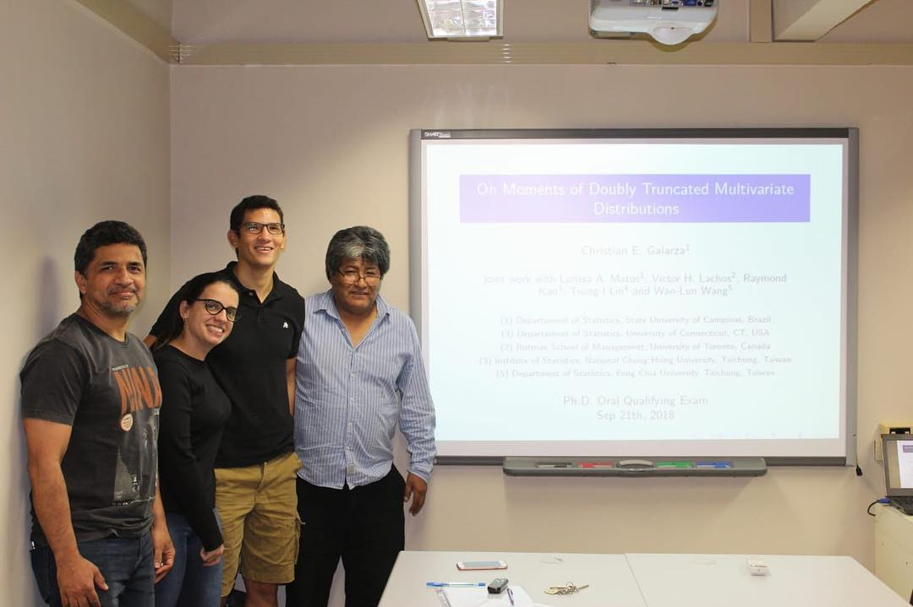
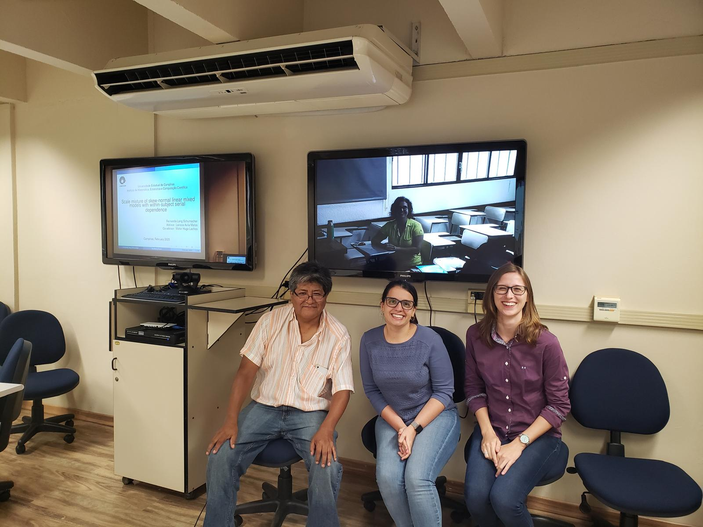
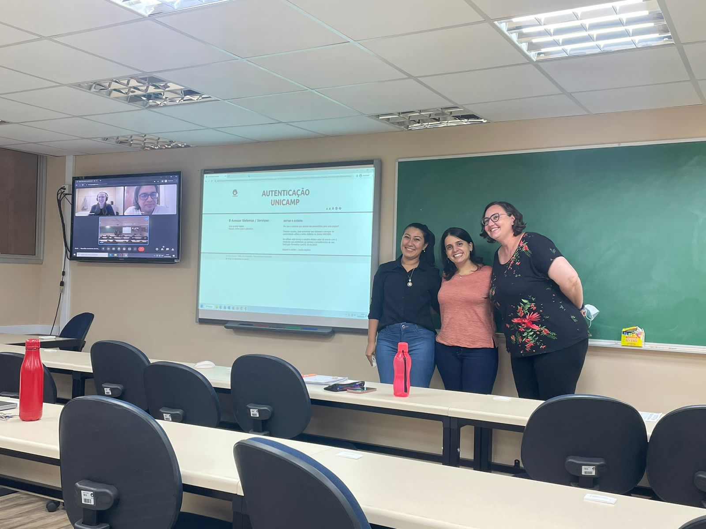
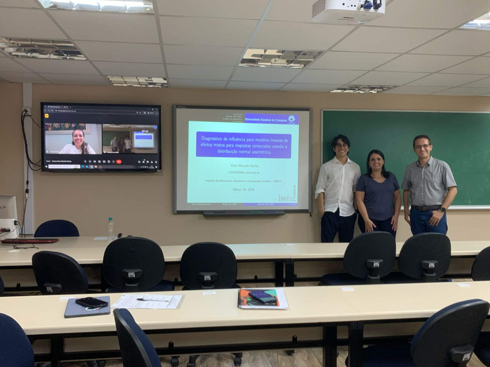
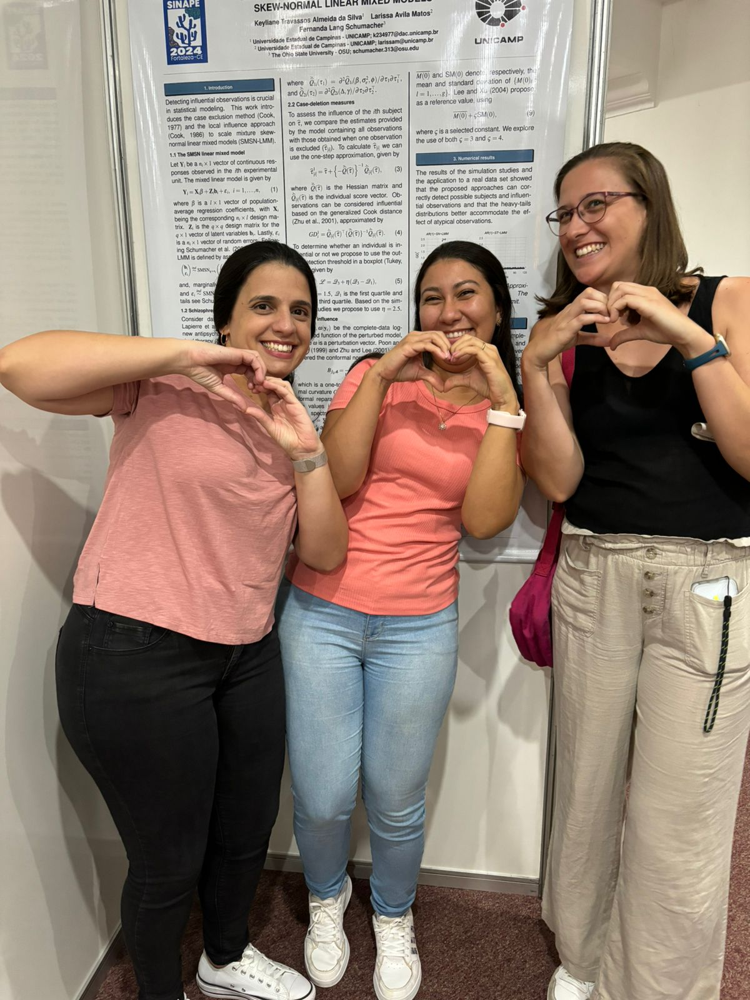

```{r setup, include=FALSE}
knitr::opts_chunk$set(echo = TRUE)
library(magick)
```

<style>
.column-f5{
  float: left;
  width: 16.5%;
  text-align: center;
}
.column-f2c{
  float: left;
  width: 33.33%;
  text-align: center;
}
.row:after {
  content: "";
  display: table;
  clear: both;
}
#myImg {
  border-radius: 5px;
  cursor: pointer;
  transition: 0.3s;
}

#myImg:hover {opacity: 0.7;}

/* The Modal (background) */
.modal {
  display: none; /* Hidden by default */
  position: fixed; /* Stay in place */
  z-index: 1; /* Sit on top */
  padding-top: 100px; /* Location of the box */
  left: 0;
  top: 0;
  width: 100%; /* Full width */
  height: 100%; /* Full height */
  overflow: auto; /* Enable scroll if needed */
  background-color: rgb(0,0,0); /* Fallback color */
  background-color: rgba(0,0,0,0.9); /* Black w/ opacity */
}

/* Modal Content (image) */
.modal-content {
  margin: auto;
  display: block;
  width: 50%;
  max-width: 700px;
}

/* Caption of Modal Image */
#caption {
  margin: auto;
  display: block;
  width: 80%;
  max-width: 700px;
  text-align: center;
  color: #ccc;
  padding: 10px 0;
  height: 150px;
}

/* Add Animation */
.modal-content, #caption {  
  -webkit-animation-name: zoom;
  -webkit-animation-duration: 0.6s;
  animation-name: zoom;
  animation-duration: 0.6s;
}

@-webkit-keyframes zoom {
  from {-webkit-transform:scale(0)} 
  to {-webkit-transform:scale(1)}
}

@keyframes zoom {
  from {transform:scale(0)} 
  to {transform:scale(1)}
}

/* The Close Button */
.close {
  position: absolute;
  top: 45px;
  right: 45px;
  color: #f1f1f1;
  font-size: 40px;
  font-weight: bold;
  transition: 0.3s;
}

.close:hover,
.close:focus {
  color: #bbb;
  text-decoration: none;
  cursor: pointer;
}

/* 100% Image Width on Smaller Screens */
@media only screen and (max-width: 700px){
  .modal-content {
    width: 100%;
  }
}
</style>

----

<div class="row">
<div class="column-f5">
<figure>
<figcaption> <p class="cc3"> [Alejandro](http://lattes.cnpq.br/7635604449274955) </p> </figcaption></figure>
</div>
<div class="column-f5">
<figure>
<figcaption> <p class="cc3"> [Carina](http://lattes.cnpq.br/9278324365724459) </p> </figcaption></figure>
</div>
<div class="column-f5">
<figure>
<figcaption> <p class="cc3"> [Christian](http://lattes.cnpq.br/1340975521059252) </p> </figcaption></figure>
</div>
<div class="column-f5">
<figure>
<figcaption> <p class="cc3"> [Fernanda](http://lattes.cnpq.br/8132149083320545) </p> </figcaption></figure>
</div>
<div class="column-f5">
<figure>
<figcaption> <p class="cc3"> [Hildemar](http://lattes.cnpq.br/0442780507213647) </p></figcaption></figure>
</div>
<div class="column-f5">
<figure>
<figcaption> <p class="cc3"> [Katherine](http://lattes.cnpq.br/8992394367424165) </p> </figcaption></figure>
</div>
</div>

<div class="row">
<div class="column-f5">
<figure>
<figcaption> <p class="cc3"> [Keyliane](http://lattes.cnpq.br/3118772117815080) </p> </figcaption></figure>
</div>
<div class="column-f5">
<figure>
<figcaption> <p class="cc3"> [Letícia](http://lattes.cnpq.br/7158806142046600) </p></figcaption></figure>
</div>
<div class="column-f5">
<figure>
<figcaption> <p class="cc3"> [Marcela](http://lattes.cnpq.br/5012340622923104) </p> </figcaption></figure>
</div>
<div class="column-f5">
<figure>
<figcaption> <p class="cc3"> [Thalita](http://lattes.cnpq.br/9500569794852267) </p> </figcaption></figure>
</div>
<div class="column-f5">
<figure>
<figcaption> <p class="cc3"> [Vitor](http://lattes.cnpq.br/7749317090142178) </p> </figcaption></figure>
</div>
</div>

<!-- <div class="row"> -->
<!-- <div class="column-f5"> -->
<!-- <figure> -->
<!-- <figcaption> <p class="cc3"> [Christian](http://lattes.cnpq.br/1340975521059252) </p> </figcaption></figure> -->
<!-- </div> -->
<!-- <div class="column-f5"> -->
<!-- <figure> -->
<!-- <figcaption> <p class="cc3"> [Thalita](http://lattes.cnpq.br/9500569794852267) </p> </figcaption></figure> -->
<!-- </div> -->
<!-- <div class="column-f5"> -->
<!-- <figure> -->
<!-- <figcaption> <p class="cc3"> [Hildemar](http://lattes.cnpq.br/0442780507213647) </p></figcaption></figure> -->
<!-- </div> -->
<!-- <div class="column-f5"> -->
<!-- <figure> -->
<!-- <figcaption> <p class="cc3"> [Alejandro](http://lattes.cnpq.br/7635604449274955) </p> </figcaption></figure> -->
<!-- </div> -->
<!-- <div class="column-f5"> -->
<!-- <figure> -->
<!-- <figcaption> <p class="cc3"> [Fernanda](http://lattes.cnpq.br/8132149083320545) </p> </figcaption></figure> -->
<!-- </div> -->
<!-- <div class="column-f5"> -->
<!-- <figure> -->
<!-- <figcaption> <p class="cc3"> [Marcela](http://lattes.cnpq.br/5012340622923104) </p> </figcaption></figure> -->
<!-- </div> -->
<!-- <div class="column-f5"> -->
<!-- <figure> -->
<!-- <figcaption> <p class="cc3"> [Katherine](http://lattes.cnpq.br/8992394367424165) </p> </figcaption></figure> -->
<!-- </div> -->
<!-- </div> -->

----

## Defesas 

<div class="row">
<div class="column-f2c">

<div id="myModal" class="modal">
  <span class="close">&times;</span>
  
  <div id="caption"></div>
</div>
<figcaption> <p class="cc3"> Defesa Mestrado Marcela - 23/02/2018 </p></figcaption>
</div>
<div class="column-f2c">

<div id="myModal" class="modal">
  <span class="close">&times;</span>
  
  <div id="caption"></div>
</div>
<figcaption> <p class="cc3"> Qualificação Doutorado Christian - 21/09/2018 </p></figcaption>
</div>
<div class="column-f2c">

<div id="myModal" class="modal">
  <span class="close">&times;</span>
  
  <div id="caption"></div>
</div>
<figcaption> <p class="cc3"> Qualificação Doutorado Thalita - 26/10/2018 </p></figcaption>
</div>
</div>

</br>

<div class="row">
<div class="column-f2c">

<div id="myModal" class="modal">
  <span class="close">&times;</span>
  
  <div id="caption"></div>
</div>
<figcaption> <p class="cc3"> Defesa Mestrado Katherine - 22/02/2019 </p></figcaption>
</div>
<div class="column-f2c">

<div id="myModal" class="modal">
  <span class="close">&times;</span>
  
  <div id="caption"></div>
</div>
<figcaption> <p class="cc3"> Qualificação Doutorado Hildemar - 10/05/2019 </p></figcaption>
</div>
<div class="column-f2c">

<div id="myModal" class="modal">
  <span class="close">&times;</span>
  
  <div id="caption"></div>
</div>
<figcaption> <p class="cc3"> Qualificação Doutorado Fernada - 28/02/2020 </p></figcaption>
</div>
</div>

</br>

<div class="row">
<div class="column-f2c">

<div id="myModal" class="modal">
  <span class="close">&times;</span>
  
  <div id="caption"></div>
</div>
<figcaption> <p class="cc3"> Qualificação Doutorado Alejandro - 13/03/2020 </p></figcaption>
</div>
<div class="column-f2c">

<div id="myModal" class="modal">
  <span class="close">&times;</span>
  
  <div id="caption"></div>
</div>
<figcaption> <p class="cc3"> Defesa Doutorado Christian - 23/03/2020 </p></figcaption>
</div>
<div class="column-f2c">

<div id="myModal" class="modal">
  <span class="close">&times;</span>
  
  <div id="caption"></div>
</div>
<figcaption> <p class="cc3"> Defesa Doutorado Thalita - 03/07/2020 </p></figcaption>
</div>
</div>

</br>

<div class="row">
<div class="column-f2c">

<div id="myModal" class="modal">
  <span class="close">&times;</span>
  
  <div id="caption"></div>
</div>
<figcaption> <p class="cc3"> Defesa Doutorado Fernanda - 01/10/2021 </p></figcaption>
</div>
<div class="column-f2c">

<div id="myModal" class="modal">
  <span class="close">&times;</span>
  
  <div id="caption"></div>
</div>
<figcaption> <p class="cc3"> Qualificação Doutorado Katherine - 24/02/2022 </p></figcaption>
</div>
<div class="column-f2c">

<div id="myModal" class="modal">
  <span class="close">&times;</span>
  
  <div id="caption"></div>
</div>
<figcaption> <p class="cc3"> Qualificação Doutorado Carina - 25/09/2023 </p></figcaption>
</div>
</div>

</br>

<div class="row">
<div class="column-f2c">

<div id="myModal" class="modal">
  <span class="close">&times;</span>
  
  <div id="caption"></div>
</div>
<figcaption> <p class="cc3"> Defesa Mestrado Keyliane - 01/03/2023 </p></figcaption>
</div>
<div class="column-f2c">

<div id="myModal" class="modal">
  <span class="close">&times;</span>
  
  <div id="caption"></div>
</div>
<figcaption> <p class="cc3"> Defesa Mestrado Vitor - 15/03/2024 </p></figcaption>
</div>
<div class="column-f2c">

<div id="myModal" class="modal">
  <span class="close">&times;</span>
  
  <div id="caption"></div>
</div>
<figcaption> <p class="cc3"> Defesa Mestrado Leticia  - 03/04/2024 </p></figcaption>
</div>
</div>

</br>

<div class="row">
<div class="column-f2c">

<div id="myModal" class="modal">
  <span class="close">&times;</span>
  
  <div id="caption"></div>
</div>
<figcaption> <p class="cc3"> Defesa Doutorado Katherine - 13/08/2024 </p></figcaption>
</div>
</div>

</br>

----

</br>

<div class="row">
<div class="column-f2c">

<div id="myModal" class="modal">
  <span class="close">&times;</span>
  
  <div id="caption"></div>
</div>
</div>
<div class="column-f2c">

<div id="myModal" class="modal">
  <span class="close">&times;</span>
  
  <div id="caption"></div>
</div>
</div>
<div class="column-f2c">

<div id="myModal" class="modal">
  <span class="close">&times;</span>
  
  <div id="caption"></div>
</div>
</div>
</div>

</br>


<div class="row">
<div class="column-f2c">

<div id="myModal" class="modal">
  <span class="close">&times;</span>
  
  <div id="caption"></div>
</div>
</div>
<div class="column-f2c">

<div id="myModal" class="modal">
  <span class="close">&times;</span>
  
  <div id="caption"></div>
</div>
</div>
<div class="column-f2c">

<div id="myModal" class="modal">
  <span class="close">&times;</span>
  
  <div id="caption"></div>
</div>
</div>
</div>

</br>

<div class="row">
<div class="column-f2c">

<div id="myModal" class="modal">
  <span class="close">&times;</span>
  
  <div id="caption"></div>
</div>
</div>
<div class="column-f2c">

<div id="myModal" class="modal">
  <span class="close">&times;</span>
  
  <div id="caption"></div>
</div>
</div>
<div class="column-f2c">

<div id="myModal" class="modal">
  <span class="close">&times;</span>
  
  <div id="caption"></div>
</div>
</div>
</div>

</br>

<div class="row">
<div class="column-f2c">

<div id="myModal" class="modal">
  <span class="close">&times;</span>
  
  <div id="caption"></div>
</div>
</div>
<div class="column-f2c">

<div id="myModal" class="modal">
  <span class="close">&times;</span>
  
  <div id="caption"></div>
</div>
</div>
<div class="column-f2c">

<div id="myModal" class="modal">
  <span class="close">&times;</span>
  
  <div id="caption"></div>
</div>
</div>
</div>

</br>

<script>
// Get the modal
var modal = document.getElementById("myModal");
// Get the image and insert it inside the modal - use its "alt" text as a caption
var images = document.getElementsByClassName("imageClass");
for(var i = 0; i < images.length; i++){
    var img = images[i];
    var modalImg = document.getElementById("img01");
    var captionText = document.getElementById("caption");
    img.onclick = function(){
        modal.style.display = "block";
        modalImg.src = this.src;
        modalImg.alt = this.alt;
        captionText.innerHTML = this.alt;
    }
}
// Get the <span> element that closes the modal
var span = document.getElementsByClassName("close")[0];
// When the user clicks on <span> (x), close the modal
span.onclick = function() { 
  modal.style.display = "none";
}
</script>

<!-- ----------------------- -->
<p class="outset"></p>
<div id="footer">
<p>
<div class="column-f1">

</div>
<div class="column-f2">

</div>
</p>
</div>