```{r setup, include=FALSE}
knitr::opts_chunk$set(echo = TRUE)
library(magick)
```

<style>
.column-f5{
float: left;
width: 14.28%;
text-align: center;
}
.column-f2c{
float: left;
width: 33.33%;
text-align: center;
}
.row:after {
content: "";
display: table;
clear: both;
}

#myImg {
  border-radius: 5px;
  cursor: pointer;
  transition: 0.3s;
}

#myImg:hover {opacity: 0.7;}

/* The Modal (background) */
.modal {
  display: none; /* Hidden by default */
  position: fixed; /* Stay in place */
  z-index: 1; /* Sit on top */
  padding-top: 100px; /* Location of the box */
  left: 0;
  top: 0;
  width: 100%; /* Full width */
  height: 100%; /* Full height */
  overflow: auto; /* Enable scroll if needed */
  background-color: rgb(0,0,0); /* Fallback color */
  background-color: rgba(0,0,0,0.9); /* Black w/ opacity */
}

/* Modal Content (image) */
.modal-content {
  margin: auto;
  display: block;
  width: 50%;
  max-width: 700px;
}

/* Caption of Modal Image */
#caption {
  margin: auto;
  display: block;
  width: 80%;
  max-width: 700px;
  text-align: center;
  color: #ccc;
  padding: 10px 0;
  height: 150px;
}

/* Add Animation */
.modal-content, #caption {  
  -webkit-animation-name: zoom;
  -webkit-animation-duration: 0.6s;
  animation-name: zoom;
  animation-duration: 0.6s;
}

@-webkit-keyframes zoom {
  from {-webkit-transform:scale(0)} 
  to {-webkit-transform:scale(1)}
}

@keyframes zoom {
  from {transform:scale(0)} 
  to {transform:scale(1)}
}

/* The Close Button */
.close {
  position: absolute;
  top: 45px;
  right: 45px;
  color: #f1f1f1;
  font-size: 40px;
  font-weight: bold;
  transition: 0.3s;
}

.close:hover,
.close:focus {
  color: #bbb;
  text-decoration: none;
  cursor: pointer;
}

/* 100% Image Width on Smaller Screens */
@media only screen and (max-width: 700px){
  .modal-content {
    width: 100%;
  }
}
</style>

----

#### Departamento de Estatística - IMECC/Unicamp
<p class="ptitle"> \ </p>

<div class="row">
<div class="column-f2c">
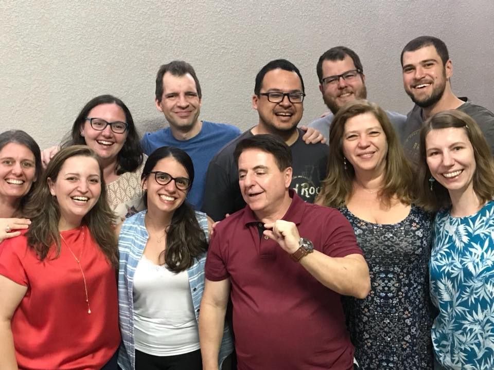
<div id="myModal" class="modal">
  <span class="close">&times;</span>
  
  <div id="caption"></div>
</div>
<figcaption> <p class="cc3"> DE </p></figcaption>
</div>
<div class="column-f2c">
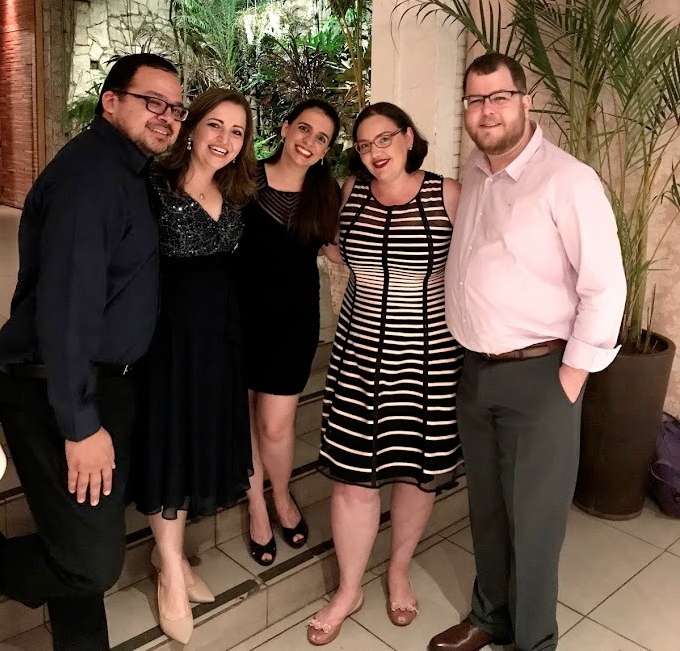
<div id="myModal" class="modal">
  <span class="close">&times;</span>
  
  <div id="caption"></div>
</div>
<figcaption> <p class="cc3"> =D </p></figcaption>
</div>
<div class="column-f2c">
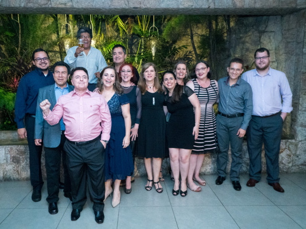
<div id="myModal" class="modal">
  <span class="close">&times;</span>
  
  <div id="caption"></div>
</div>
<figcaption> <p class="cc3"> 50 anos IMECC </p></figcaption>
</div>
</div>

----

#### Congressos
<p class="ptitle"> \ </p>

<div class="row">
<div class="column-f2c">
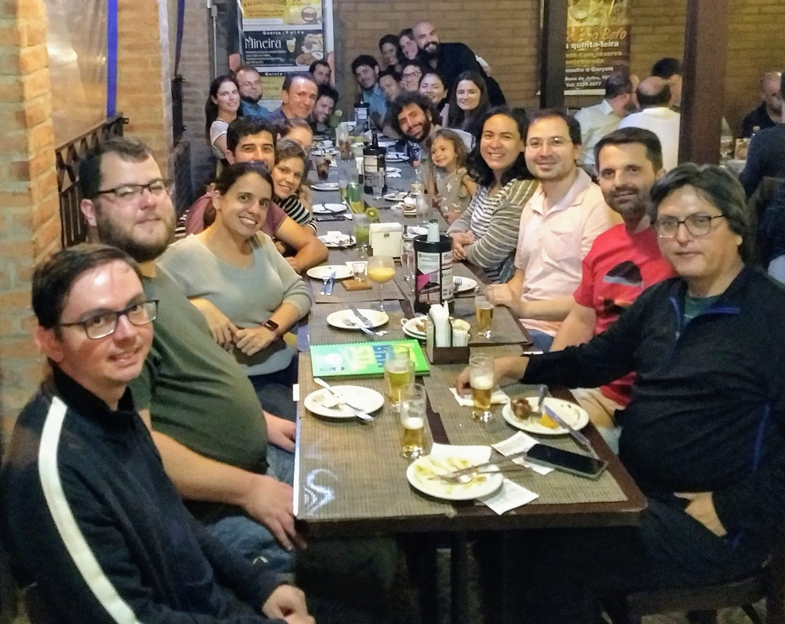
<div id="myModal" class="modal">
  <span class="close">&times;</span>
  
  <div id="caption"></div>
</div>
<figcaption> <p class="cc3"> 2020 - 8th WPSM - São Carlos/SP </p></figcaption>
</div>
<div class="column-f2c">
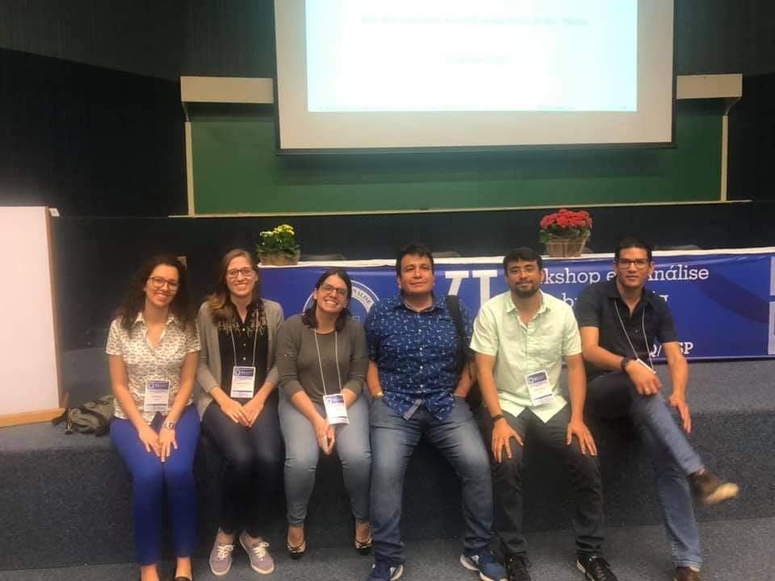
<div id="myModal" class="modal">
  <span class="close">&times;</span>
  
  <div id="caption"></div>
</div>
<figcaption> <p class="cc3"> 2019 - VI WASA - Piracicaba/SP </p></figcaption>
</div>
<div class="column-f2c">
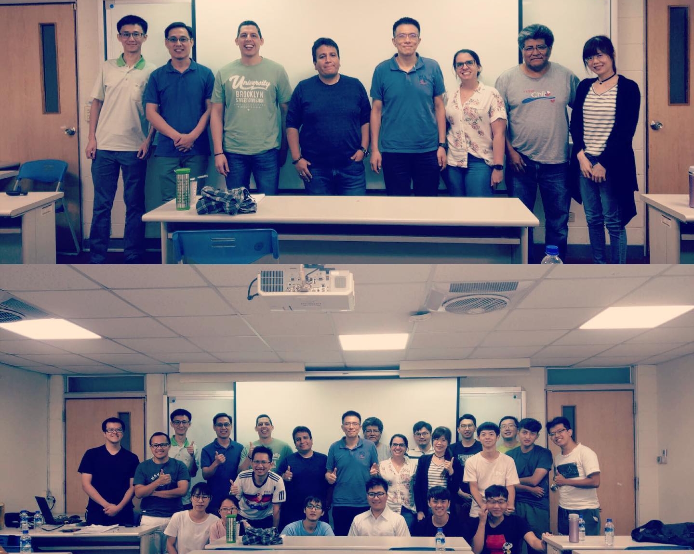
<div id="myModal" class="modal">
  <span class="close">&times;</span>
  
  <div id="caption"></div>
</div>
<figcaption> <p class="cc3"> 2019 - 3rd EcoSta - Taichung/Taiwan </p></figcaption>
</div>
</div>

</br>

<div class="row">
<div class="column-f2c">
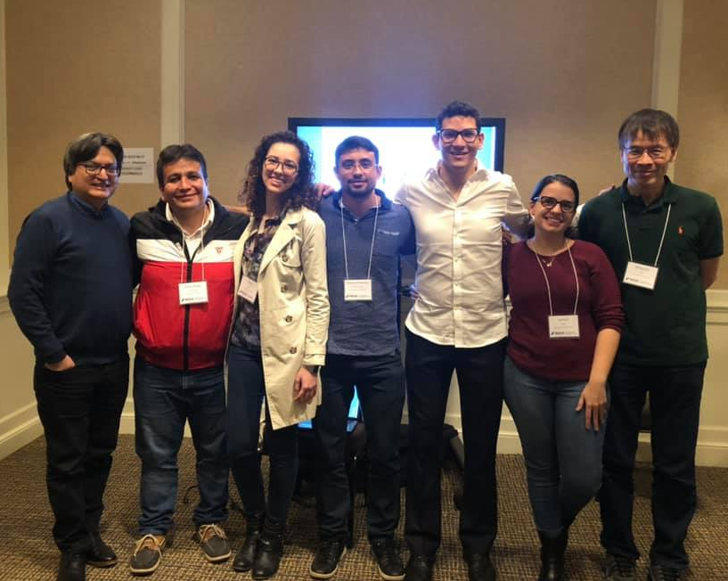
<div id="myModal" class="modal">
  <span class="close">&times;</span>
  
  <div id="caption"></div>
</div>
<figcaption> <p class="cc3"> 2019 - 33th NESS - Hartford/USA </p></figcaption>
</div>
<div class="column-f2c">
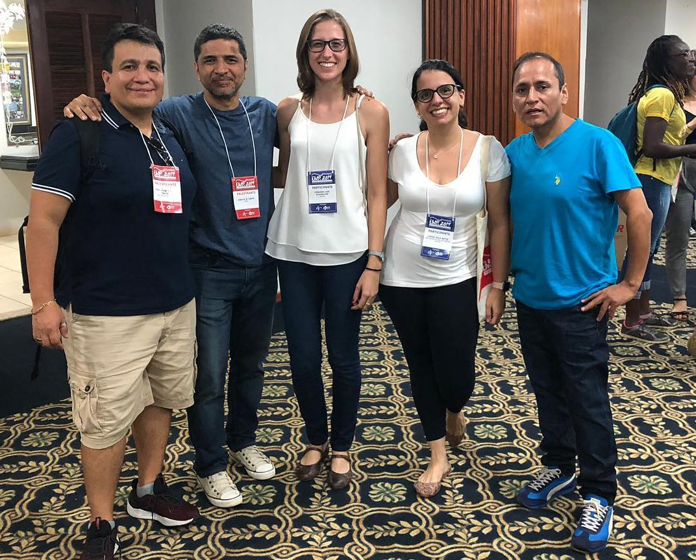
<div id="myModal" class="modal">
  <span class="close">&times;</span>
  
  <div id="caption"></div>
</div>
<figcaption> <p class="cc3"> 2019 - XVI EMR -  Pirenópolis/GO </p></figcaption>
</div>
<div class="column-f2c">
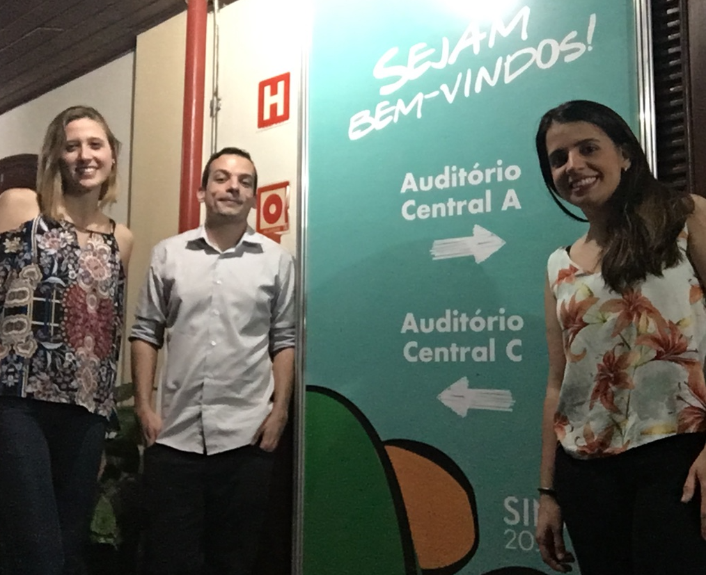
<div id="myModal" class="modal">
  <span class="close">&times;</span>
  
  <div id="caption"></div>
</div>
<figcaption> <p class="cc3"> 2018 - 23º SINAPE - São Pedro/SP </p></figcaption>
</div>
</div>

</br>

<div class="row">
<div class="column-f2c">

<div id="myModal" class="modal">
  <span class="close">&times;</span>
  
  <div id="caption"></div>
</div>
<figcaption> <p class="cc3"> 2017 - 10th CMStatistics - London/UK  </p></figcaption>
</div>
<div class="column-f2c">
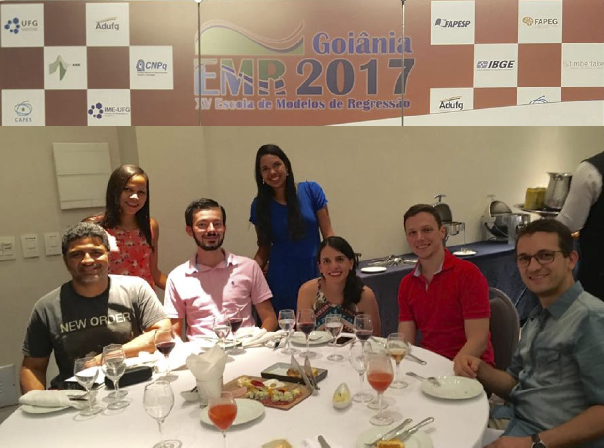
<div id="myModal" class="modal">
  <span class="close">&times;</span>
  
  <div id="caption"></div>
</div>
<figcaption> <p class="cc3"> 2017 - XV EMR -  Goiânia/GO </p></figcaption>
</figure>
</div>
<div class="column-f2c">
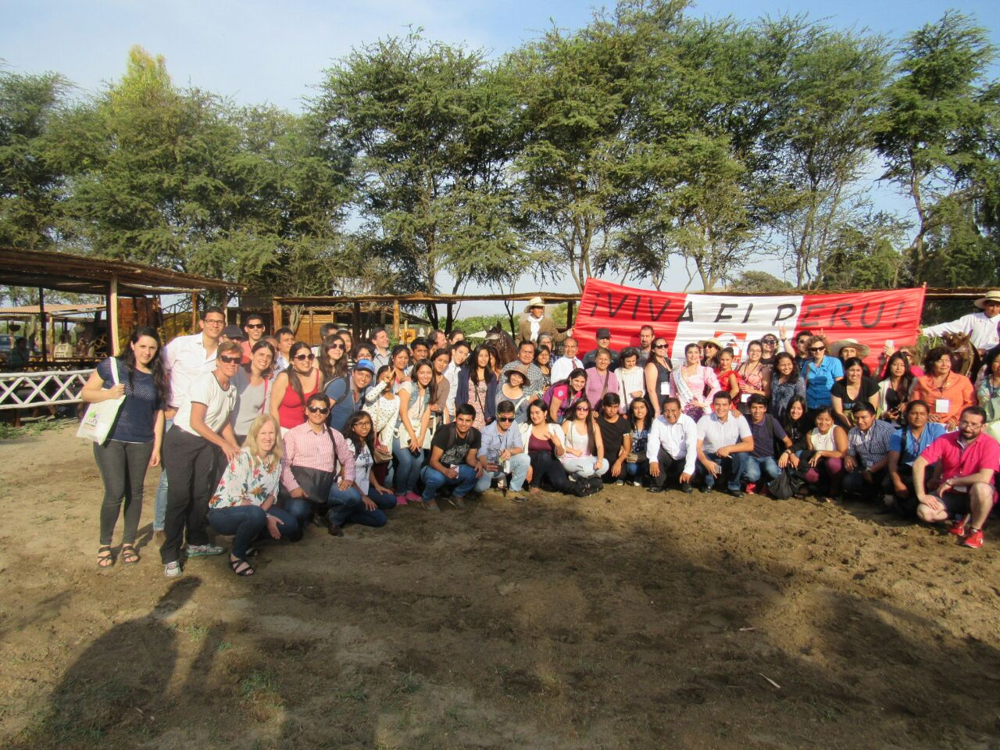
<div id="myModal" class="modal">
  <span class="close">&times;</span>
  
  <div id="caption"></div>
</div>
<figcaption> <p class="cc3"> 2016 - CLATSE - Chiclayo/Peru </p></figcaption>
</figure>
</div>
</div>

</br>

<div class="row">
<div class="column-f2c">
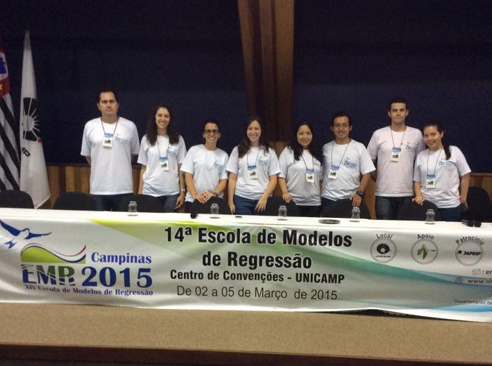
<div id="myModal" class="modal">
  <span class="close">&times;</span>
  
  <div id="caption"></div>
</div>
<figcaption> <p class="cc3"> 2015 - XIV EMR - Campinas/SP </p></figcaption>
</div>
<div class="column-f2c">

<div id="myModal" class="modal">
  <span class="close">&times;</span>
  
  <div id="caption"></div>
</div>
<figcaption> <p class="cc3"> 2013 - 28th IWSM - Palermo/Italy </p></figcaption>
</div>
<div class="column-f2c">
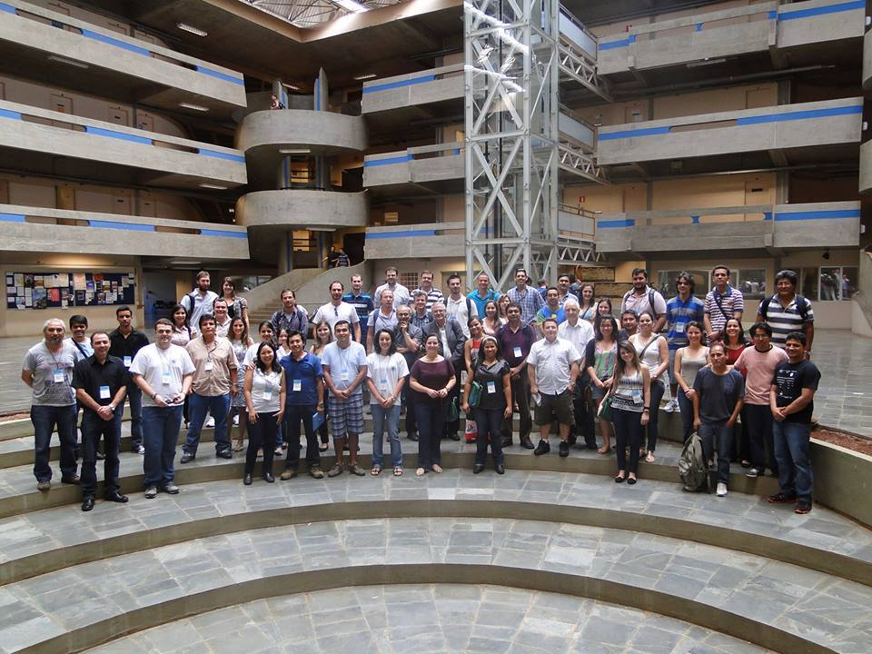
<div id="myModal" class="modal">
  <span class="close">&times;</span>
  
  <div id="caption"></div>
</div>
<figcaption> <p class="cc3"> 2013 - III WASA - Campinas/SP  </p></figcaption>
</div>
</div>

</br>

<div class="row">
<div class="column-f2c">
<figcaption> <p class="cc3"> 2012 - 20º SINAPE - João Pessoa/PB </p></figcaption>
</div>
<div class="column-f2c">
<figcaption> <p class="cc3"> 2012 - 27th IWSM - Prague/Czech Republic </p></figcaption>
</div>
<div class="column-f2c">
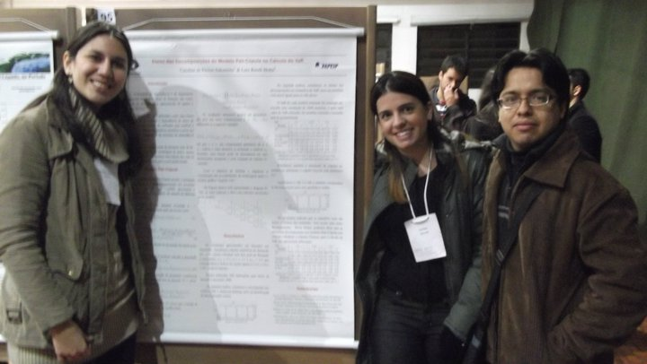
<div id="myModal" class="modal">
  <span class="close">&times;</span>
  
  <div id="caption"></div>
</div>
<figcaption> <p class="cc3"> 2011 - 14ª ESTE - Gramado/RS </p></figcaption>
</div>
</div>

</br>

----

#### Trajetória acadêmica
<p class="ptitle"> \ </p>

<div class="row">
<div class="column-f2c">
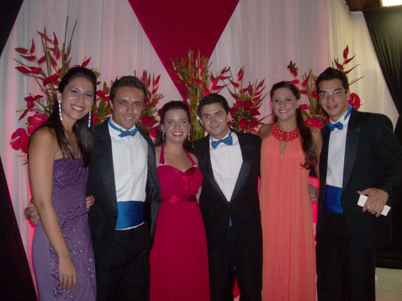
<div id="myModal" class="modal">
  <span class="close">&times;</span>
  
  <div id="caption"></div>
</div>
<figcaption> <p class="cc3"> Graduação </p></figcaption>
</div>
<div class="column-f2c">
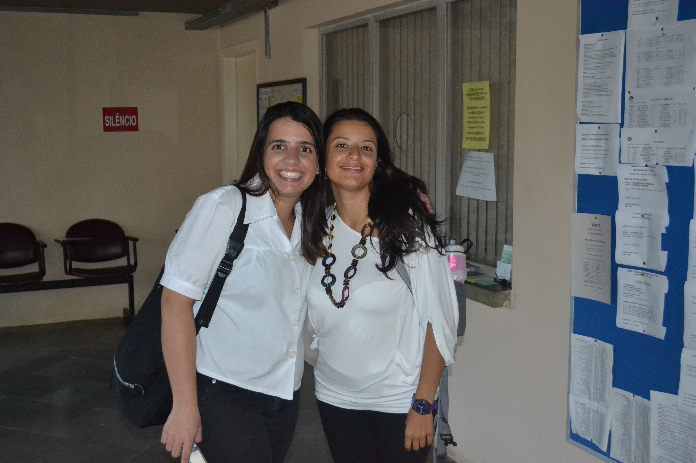
<div id="myModal" class="modal">
  <span class="close">&times;</span>
  
  <div id="caption"></div>
</div>
<figcaption> <p class="cc3"> Defesa Mestrado </p></figcaption>
</div>
<div class="column-f2c">
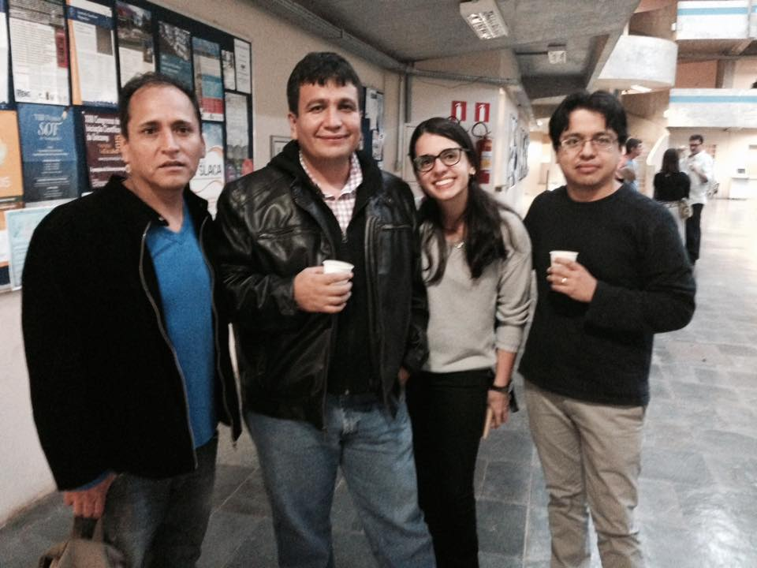
<div id="myModal" class="modal">
  <span class="close">&times;</span>
  
  <div id="caption"></div>
</div>
<figcaption> <p class="cc3"> Qualificação Doutorado </p></figcaption>
</div>
</div>

</br>

<div class="row">
<div class="column-f2c">
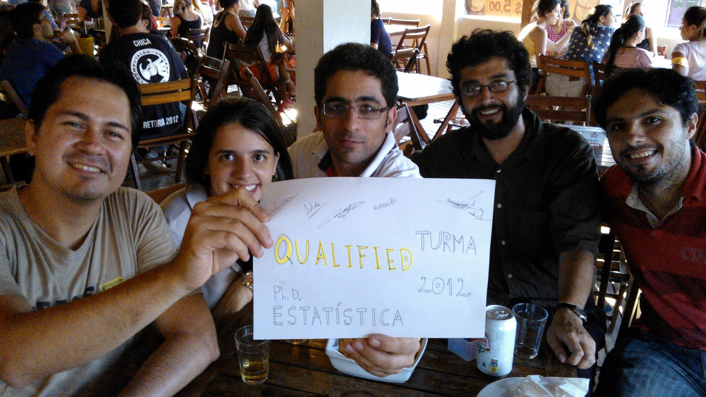
<div id="myModal" class="modal">
  <span class="close">&times;</span>
  
  <div id="caption"></div>
</div>
<figcaption> <p class="cc3"> Qualificação Escrita Doutorado </p></figcaption>
</div>
<div class="column-f2c">
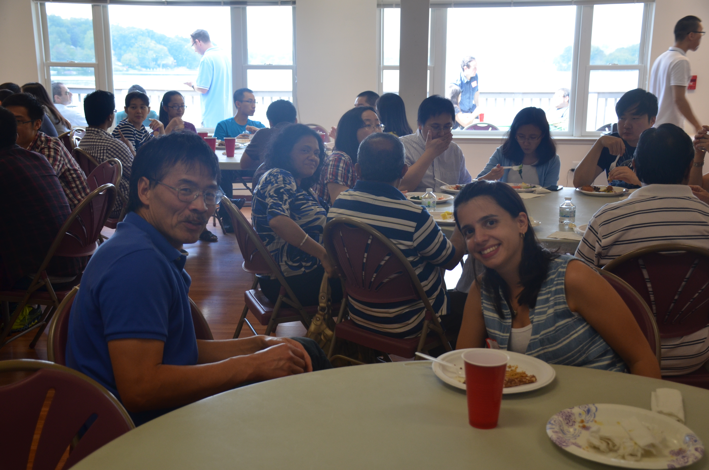
<div id="myModal" class="modal">
  <span class="close">&times;</span>
  
  <div id="caption"></div>
</div>
<figcaption> <p class="cc3"> Uconn - Chen </p></figcaption>
</div>
<div class="column-f2c">
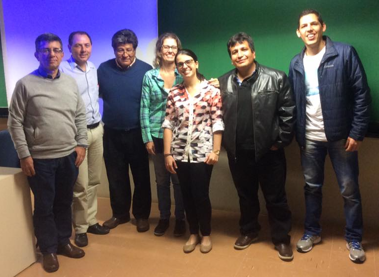
<div id="myModal" class="modal">
  <span class="close">&times;</span>
  
  <div id="caption"></div>
</div>
<figcaption> <p class="cc3"> Defesa Doutorado </p></figcaption>
</div>
</div>

</br>


<script>
// Get the modal
var modal = document.getElementById("myModal");
// Get the image and insert it inside the modal - use its "alt" text as a caption
var images = document.getElementsByClassName("imageClass");
for(var i = 0; i < images.length; i++){
    var img = images[i];
    var modalImg = document.getElementById("img01");
    var captionText = document.getElementById("caption");
    img.onclick = function(){
        modal.style.display = "block";
        modalImg.src = this.src;
        modalImg.alt = this.alt;
        captionText.innerHTML = this.alt;
    }
}
// Get the <span> element that closes the modal
var span = document.getElementsByClassName("close")[0];
// When the user clicks on <span> (x), close the modal
span.onclick = function() { 
  modal.style.display = "none";
}
</script>

<!-- ----------------------- -->

<p class="outset"></p>
<div id="footer">
<p>
<div class="column-f1">

</div>
<div class="column-f2">

</div>
</p>
</div>