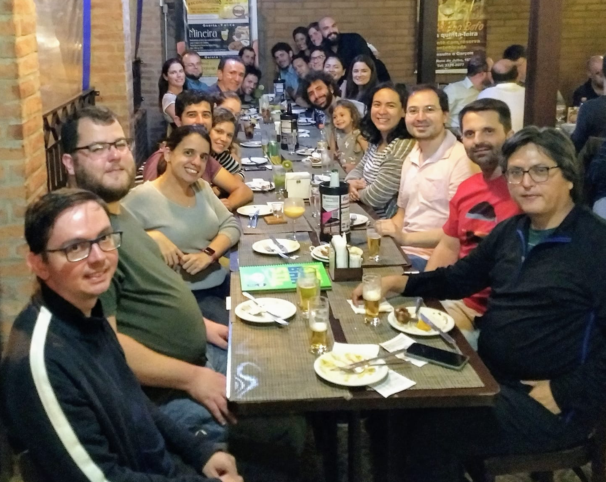
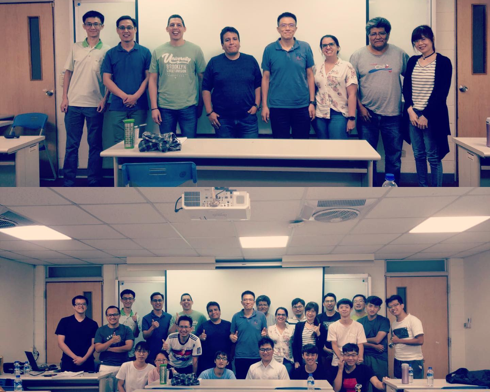
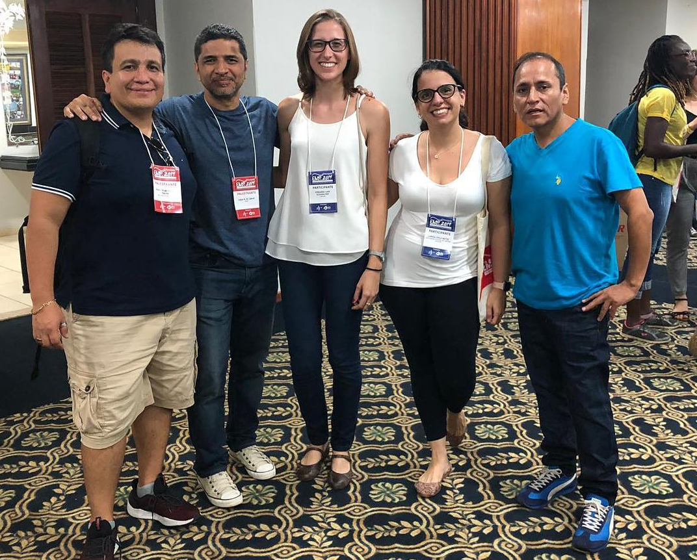
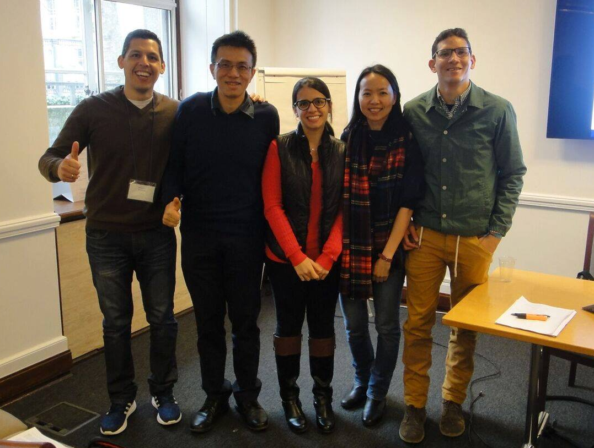
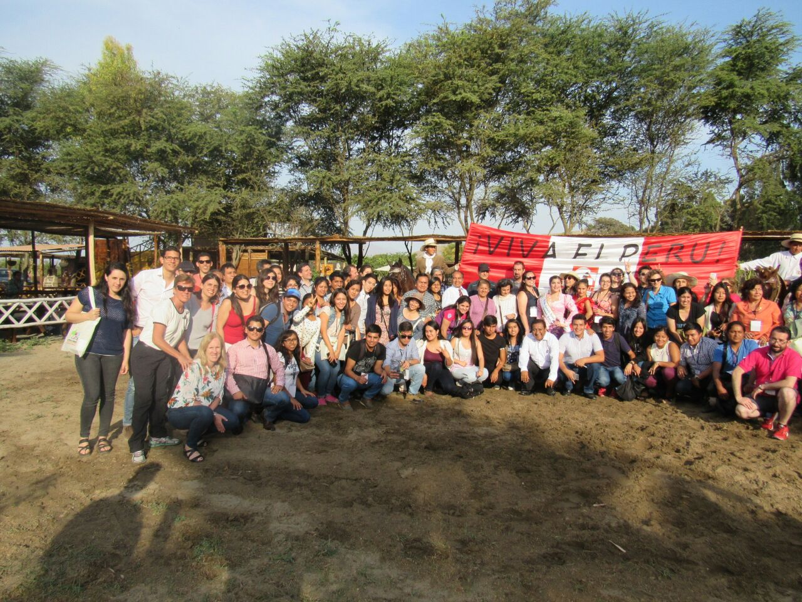
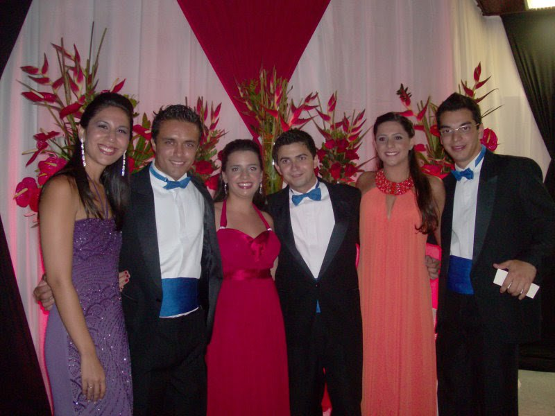
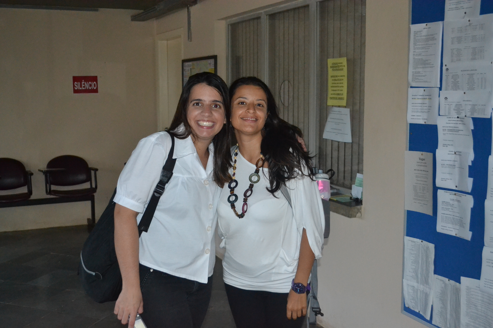
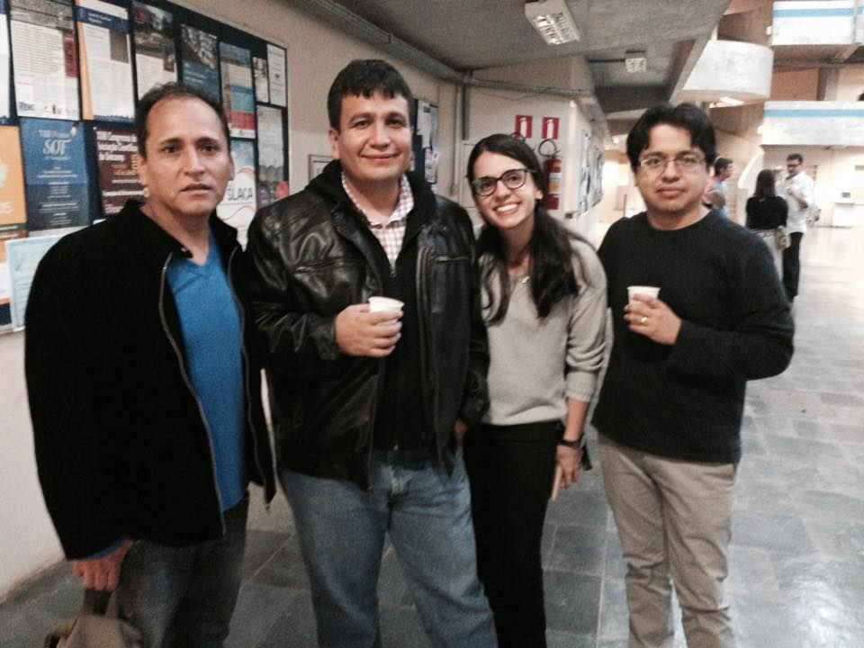
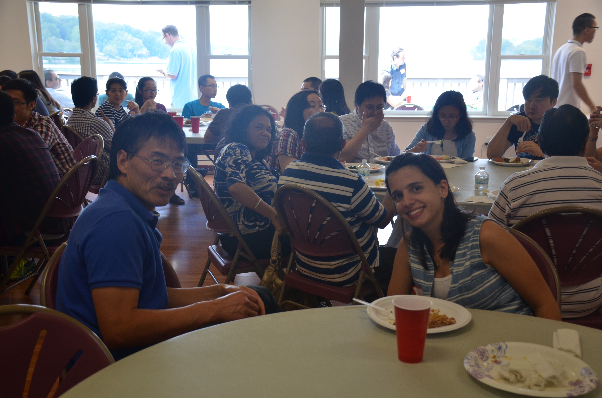

```{r setup, include=FALSE}
knitr::opts_chunk$set(echo = TRUE)
library(magick)
```

<style>
.column-f5{
float: left;
width: 14.28%;
text-align: center;
}
.column-f2c{
float: left;
width: 33.33%;
text-align: center;
}
.row:after {
content: "";
display: table;
clear: both;
}
</style>

----

#### Departamento de Estatística - IMECC/Unicamp
<p class="ptitle"> \ </p>

<div class="row">
<div class="column-f2c">
<figure>
<figcaption> <p class="cc3"> DE </p></figcaption>
</figure>
</div>
<div class="column-f2c">
<figure>
<figcaption> <p class="cc3"> =D </p></figcaption>
</figure>
</div>
<div class="column-f2c">
</div>
</div>

</br>

----

#### Congressos
<p class="ptitle"> \ </p>

<div class="row">
<div class="column-f2c">
<figure>
<figcaption> <p class="cc3"> 2020 - 8th WPSM - São Carlos/SP </p></figcaption>
</figure>
</div>
<div class="column-f2c">
<figure>
<figcaption> <p class="cc3"> 2019 - VI WASA - Piracicaba/SP </p></figcaption>
</figure>
</div>
<div class="column-f2c">
<figure>
<figcaption> <p class="cc3"> 2019 - 3rd EcoSta - Taichung/Taiwan </p></figcaption>
</div>
</div>

</br>

<div class="row">
<div class="column-f2c">
<figure>
<figcaption> <p class="cc3"> 2019 - 33th NESS - Hartford/USA </p></figcaption>
</div>
<div class="column-f2c">
<figure>
<figcaption> <p class="cc3"> 2019 - XVI EMR -  Pirenópolis/GO </p></figcaption>
</figure>
</div>
<div class="column-f2c">
<figure>
<figcaption> <p class="cc3"> 2018 - 23º SINAPE - São Pedro/SP </p></figcaption>
</figure>
</div>
</div>

</br>

<div class="row">
<div class="column-f2c">
<figure>
<figcaption> <p class="cc3"> 2017 - 10th CMStatistics - London/UK  </p></figcaption>
</div>
<div class="column-f2c">
<figure>
<figcaption> <p class="cc3"> 2017 - XV EMR -  Goiânia/GO </p></figcaption>
</figure>
</div>
<div class="column-f2c">
<figure>
<figcaption> <p class="cc3"> 2016 - CLATSE - Chiclayo/Peru </p></figcaption>
</figure>
</div>
</div>

</br>

<div class="row">
<div class="column-f2c">
<figure>
<figcaption> <p class="cc3"> 2015 - XIV EMR - Campinas/SP </p></figcaption>
</figure>
</div>
<div class="column-f2c">
<figure>
<figcaption> <p class="cc3"> 2013 - 28th IWSM - Palermo/Italy </p></figcaption>
</figure>
</div>
<div class="column-f2c">
<figure>
<figcaption> <p class="cc3"> 2013 - III WASA - Campinas/SP  </p></figcaption>
</div>
</div>

</br>

<div class="row">
<div class="column-f2c">

<figcaption> <p class="cc3"> 2012 - 20º SINAPE - João Pessoa/PB </p></figcaption>
</figure>
</div>
<div class="column-f2c">

<figcaption> <p class="cc3"> 2012 - 27th IWSM - Prague/Czech Republic </p></figcaption>
</figure>
</div>
<div class="column-f2c">
<figure>
<figcaption> <p class="cc3"> 2011 - 14ª ESTE - Gramado/RS </p></figcaption>
</div>
</div>

</br>

----

#### Trajetória acadêmica
<p class="ptitle"> \ </p>

<div class="row">
<div class="column-f2c">
<figure>
<figcaption> <p class="cc3"> Graduação </p></figcaption>
</figure>
</div>
<div class="column-f2c">
<figure>
<figcaption> <p class="cc3"> Defesa Mestrado </p></figcaption>
</figure>
</div>
<div class="column-f2c">
<figure>
<figcaption> <p class="cc3"> Qualificação Doutorado </p></figcaption>
</figure>
</div>
</div>

</br>

<div class="row">
<div class="column-f2c">
<figure>
<figcaption> <p class="cc3"> Qualificação Escrita Doutorado </p></figcaption>
</figure>
</div>
<div class="column-f2c">
<figure>
<figcaption> <p class="cc3"> Uconn - Chen </p></figcaption>
</figure>
</div>
<div class="column-f2c">
<figure>
<figcaption> <p class="cc3"> Defesa Doutorado </p></figcaption>
</figure>
</div>
</div>

</br>

<!-- ----------------------- -->

<p class="outset"></p>
<div id="footer">
<p>
<div class="column-f1">

</div>
<div class="column-f2">

</div>
</p>
</div>