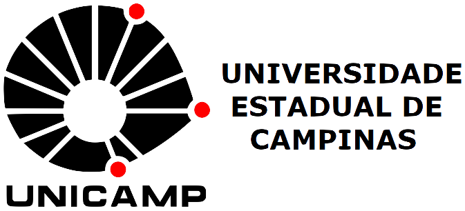

 

<!-- 
 Consultoria Estatística  
 -->

  

----

Se você tem um projeto e precisa de consultoria estatística para:

- Análise descritiva dos dados e interpretação dos resultados;
- Análise de Variância;
- Classificação e previsão;
- Aprendizado de Máquina;
- Modelagem;
- Planejamento de experimentos;
- Séries temporais;
- Entre outros.

Podemos ajudá-lo! Os alunos do bacharelado em Estatística, sob supervisão de professores do Departamento de - Estatística - IMECC - Unicamp, atuarão como consultores para o seu projeto.

A consultoria estatística para seu projeto será desenvolvida durante o semestre letivo pelos alunos matriculados nas disciplinas ME712 e ME812 - Consultoria Estatística I e II. Para isso, há necessidade de reuniões do pesquisador com os consultores ao longo do semestre. Ao final do semestre, você receberá um relatório com as análises estatísticas.

Caso haja interesse, sua inscrição deverá ser feita preenchendo o [formulário](QuestionarioPesquisador.docx) e enviando-o por e-mail para estatcon@unicamp.br. Para consultorias a serem desenvolvidas durante o **segundo semestre de 2020, a inscrição deverá ser feita até 01/09/2020.**

Para que o projeto seja considerado, é importante que todos os **dados estejam coletados e organizados em planilha eletrônica até o início de setembro.**

Em caso de participação, o pesquisador responsável deverá participar obrigatoriamente de **duas reuniões** com os alunos. A primeira reunião será no dia **09/10/2020** e a reunião final será na **última quinzena de janeiro de 2021** (horários a serem agendados). Na primeira reunião, o termo de compromisso deverá ser assinado por todos os envolvidos.

Este semestre, excepcionalmente, as reuniões se darão através do Google Meet.

O resultado sobre a seleção dos projetos será divulgado durante a segunda quinzena de setembro de 2020.

Para receber mais informações sobre novos períodos de inscrição envie um e-mail para estatcon@unicamp.br.

----

